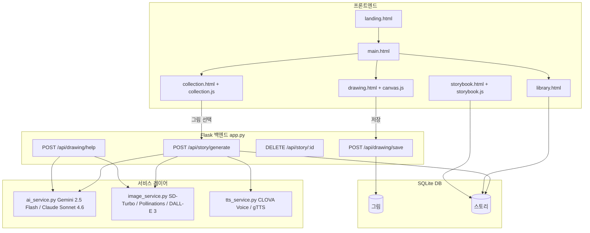
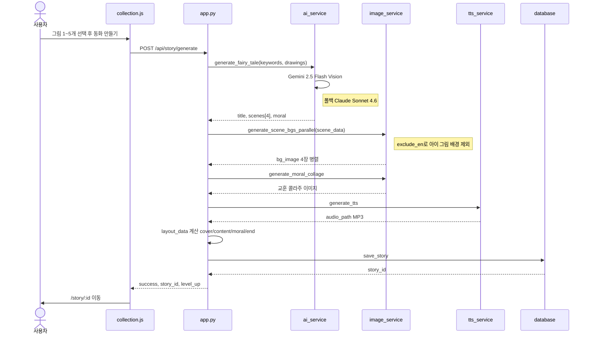
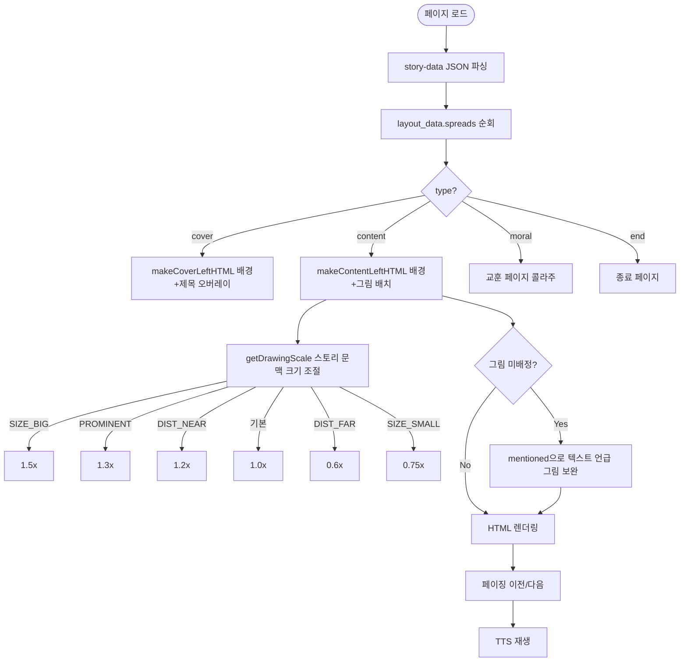

# AI 동화 만들기

아이가 직접 그린 그림으로 AI가 동화를 만들어주는 웹 앱입니다.

## 팀원 및 역할

| 이름 | 담당 역할 |
|------|----------|
| 홍찬영 | AI 스토리 생성 + 배경 이미지 생성 |
| 방혁 | 그림 그리기 캔버스 기능 |
| 김봉환 | 그린 그림 저장 및 관리 |
| 이예진 | 스토리 저장 기능 |
| 홍수진 | 스토리 저장 기능 |

---

## 서비스 흐름

```
① 단어를 보고 캔버스에 그림 그리기
② 그린 그림 1~5개 선택
③ AI가 동화 스토리 + 배경 이미지 + 음성 자동 생성
④ 완성된 동화책 감상 및 도서관에 저장
```

---

## 기술 스택

| 분류 | 기술 |
|------|------|
| 백엔드 | Python + Flask |
| AI 동화 생성 | Gemini 2.5 Flash (우선) / Claude Sonnet 4.6 (폴백) |
| AI 배경 이미지 | SD-Turbo (로컬 GPU) / Pollinations.ai (폴백) / DALL-E 3 |
| TTS 음성 | CLOVA Voice - Premium (우선) / gTTS (폴백) |
| DB | SQLite |
| 포트 | 5000 |

---

## 환경 변수 설정

 파일을 생성하고 아래 키를 입력하세요. ( 참고)

| 변수 | 필수 | 설명 |
|------|------|------|
|  | 권장 | 동화 생성 (Google AI Studio) |
|  | 선택 | Gemini 실패 시 폴백 (Claude) |
|  | 선택 | DALL-E 표지 이미지 생성 |
|  | 권장 | CLOVA Voice TTS (NCP 콘솔) |
|  | 권장 | CLOVA Voice TTS (NCP 콘솔) |
|  | 선택 | 외부 공개용 ngrok 터널 |
|  | 선택 | Flask 세션 키 (기본값 있음) |

---

## 실행 방법

```bash
# 의존성 설치
pip install -r requirements.txt

# 서버 실행 (로컬)
python app.py

# 외부 공개 (ngrok)
python run_ngrok.py --token YOUR_NGROK_TOKEN

# 브라우저 접속
http://localhost:5000
```

---

## 주요 기능

### 그림 그리기
- 랜덤 단어 제시 → 캔버스에 자유롭게 그리기
- AI 참고 이미지 생성 기능 (DALL-E 3 / Pollinations)
- 그린 그림은 그림 모음장에 저장

### AI 동화 생성
- 그림 키워드 기반으로 Gemini AI가 4장면 동화 작성
- 각 장면에 어울리는 배경 이미지 자동 생성 (병렬 처리)
- 아이 그림 객체가 배경에 중복 등장하지 않도록 제외 처리
- CLOVA Voice로 동화 전체 음성 낭독 생성 (gTTS 폴백)
- 교훈 페이지 콜라주 이미지 자동 생성

### 동화책 뷰어
- 배경 + 아이 그림 + 텍스트 + 음성이 합쳐진 동화책 형태
- 스토리 문맥에 따라 그림 크기 자동 조절
- 그림 배치 누락 시 텍스트 언급으로 자동 보완

### 도서관 & 뱃지 시스템
- 만든 동화 모아보기
- 책 수에 따라 뱃지 획득: 🌱 새싹 → 🌳 꿈나무 → ✨ 마법 → 👑 전설 작가

---

## 전체 아키텍처



---

## 동화 생성 흐름



---

## 동화책 뷰어 렌더링 흐름


